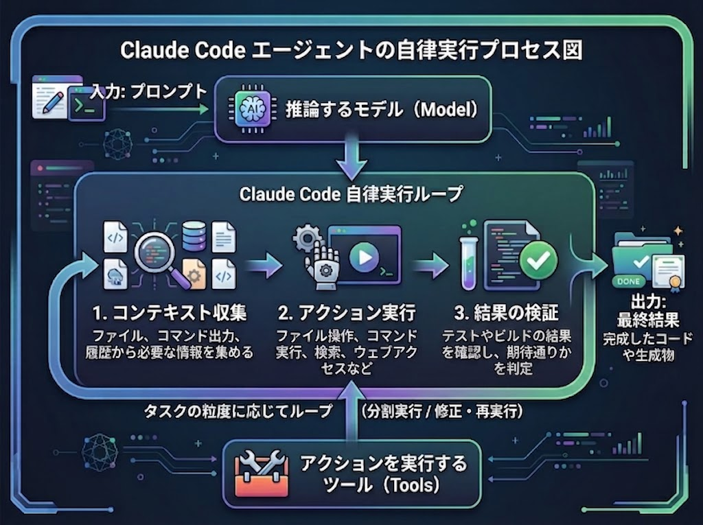

## はじめに

社内プロジェクトでClaude CodeなどのAIエージェントコーディングを始めることになりました。
強力なツールである一方、使い方を間違えればプロジェクトやシステムに取り返しのつかない影響を与えうる諸刃の剣でもあります。
だからこそ、まずは公式ドキュメントを一通り読んで基礎知識を整理しておくことが大事だと思いました。

この記事はその **インプットのアウトプット** です。
誰かに教えるというより、未来の自分が「あれ、これどうだっけ」となったときに戻ってくるための備忘録として書いています。

読んだのは主に以下の3つです。

* [Claude Codeの仕組み](https://code.claude.com/docs/ja/how-claude-code-works)
* [Claude Codeを拡張する](https://code.claude.com/docs/ja/features-overview)
* [Claude Codeのモデル、使用方法、および制限](https://support.claude.com/ja/articles/14552983-claude-code%E3%81%AE%E3%83%A2%E3%83%87%E3%83%AB-%E4%BD%BF%E7%94%A8%E6%96%B9%E6%B3%95-%E3%81%8A%E3%82%88%E3%81%B3%E5%88%B6%E9%99%90)

構成としては、

1. Claude Codeの仕組み (何が起きているのか)
2. Claude Codeを拡張する (どう育てるのか)
3. モデルと使用量 (どう節約するのか)

の順で整理しました。

:::message
2026年8月時点で読んだ内容の整理です。アップデートが速い領域なので、最新は公式ドキュメントを確認してください。
:::

---

## 1. Claude Codeの仕組み

### Claude Codeは「コーディングツール」ではなく「CLIエージェント」

まず認識を改めたのがここでした。
Claude Codeはコーディングに強いですが、できることはコーディングに限りません。**CLIでできることなら何でも支援対象** です。

* コーディング
* ドキュメント作成
* ビルド実行
* ファイル検索
* トピック調査

「コードを書かせるもの」ではなく「ターミナルで作業してくれる同僚」くらいのイメージで捉えたほうが、使い道が広がりそうだと感じました。

### 3フェーズのループ

タスク (プロンプト) を渡すと、Claudeは次の3フェーズを通じて作業します。

1. **コンテキストの収集**
2. **アクションの実行**
3. **結果の検証**

そしてこの3つは、タスクの粒度に応じて **ループ** します。
ループを駆動しているのは2つのコンポーネントです。

* 推論する **モデル**
* アクションを実行する **ツール**


*図はコーディング時の例です。実際はCLIでできる作業全般が対象になります*

この「モデル × ツール」という分解が、後から出てくる拡張機能の話にそのままつながります。
つまり **Claude Codeを強くする＝モデルを適切に選ぶ or ツールを増やす** ということですね。

### モデル

モデルはセッション中に切り替えられます。

* セッション中: `/model`
* 起動時: `claude --model <name>`

### ツール

> ツールがないと、Claudeはテキストで応答することしかできない

この一文が個人的にいちばん腹落ちしました。ツールがあるからこそ「実行」できるわけです。

組み込みツールは大きく以下のカテゴリがあります。

* ファイル操作
* 検索
* 実行
* ウェブ
* コードインテリジェンス

詳細は [ツールリファレンス](https://code.claude.com/docs/ja/tools-reference) にあります。

さらに、この組み込みツールを土台にして拡張ができます。

| 拡張 | 何が変わるか |
| --- | --- |
| スキル | Claudeが **知っていること** が増える |
| MCP | **外部サービス** につながる |
| フック | **ワークフロー** が自動化される |
| サブエージェント | **タスクをオフロード** できる |

### インターフェース

ターミナルだけではありません。

* ターミナル
* デスクトップアプリ
* IDE拡張機能
* claude.ai/code
* リモートコントロール
* Slack
* CI/CDパイプライン

完全なリストは [Claude Codeをどこでも使用する](https://code.claude.com/docs/ja/overview#use-claude-code-everywhere) を参照してください。

チーム導入を考えると、「全員ターミナルで統一」ではなく、それぞれが慣れた入り口から入れるのは地味に大きいポイントだと思いました。

### セッション

セッションは `~/.claude/projects/` 配下に **プレーンテキストのJSONL** で書き込まれます。
中身が読める形式で残るのは、あとから追跡できて安心感があります。

重要なのは以下です。

* **各セッションは独立** している (新規セッション = 新しいコンテキストウィンドウ)
* **自動メモリ** でセッション間の学習は保持される
* **CLAUDE.md** に独自の永続ルール・指示を書ける
* セッションは **ディレクトリ （プロジェクト） に紐づく** ので、ブランチを切り替えてもセッションは維持される

再開とフォークもできます。

* 再開: `claude --continue` / `claude --resume`
* フォーク: `claude --fork-session` / `/branch`

「途中まで進めた作業から、別の方針を試したい」ときにフォークが使えるのは覚えておきたいところです。

### コンテキストウィンドウ

コンテキストウィンドウには以下が積まれていきます。

* 会話履歴
* ファイルコンテンツ
* コマンド出力
* CLAUDE.md
* 自動メモリ
* 読み込まれたスキル
* システム指示

作業を進めればコンテキストは当然満杯になります。満杯になるとClaudeが自動的にコンパクト化してくれますが、**古い会話の指示が失われる可能性** があります。

対策は2つ。

* 永続的なルールは **CLAUDE.mdに入れる** (会話が圧縮されても消えない)
* `/context` で **何がスペースを使っているか確認する**

また、サブエージェントは独自の新しいコンテキストを取得し、メインセッションから完全に分離されます。作業完了後は要約だけを返します。
**この分離こそが、長いセッションでサブエージェントが役立つ理由** という説明はとても納得感がありました。「調べ物で会話を汚さない」ための仕組みなんですね。

### チェックポイント

Gitとは別に、Claudeがファイルを編集する前に現在の内容のスナップショットを作成してくれます。

* 巻き戻す: `Esc` を2回押す、またはClaudeに元に戻すよう指示する

ただし、対象範囲には注意が必要です。

| チェックポイントできる | チェックポイントできない |
| --- | --- |
| 可逆的なすべてのファイル編集 | データベース / API / デプロイメント |

「ファイル編集は戻せるが、外の世界に出た副作用は戻せない」。
チームで使うなら、ここは共通認識にしておきたいところです。

:::message alert
ここがいちばん「諸刃の剣」を意識した箇所。ファイル編集は戻せるが、DBへの書き込み・API呼び出し・デプロイは戻せない。
権限モードをAutoにするなら、この非可逆な操作が射程に入っていないかを先に確認する。
:::

### Claudeができることの制御 (権限モード)

`Shift + Tab` で権限モードをサイクルできます。

| モード | 挙動 |
| --- | --- |
| Manual | ファイル編集・シェルコマンド実行の前に確認を求める |
| Accept edits | ファイル編集や `mkdir` / `mv` などの一般的なコマンドは自動実行。それ以外は確認 |
| Plan | ファイル編集をせず、プランを提案する |
| Auto | 安全な状態を維持しながら自動でアクションを実行する |

個人的には、まず **Plan** で方針を固めてから実行フェーズに移す、という流れが安全かつ結果的に速そうだと感じています (後述の「計画を求める」とも噛み合う)。

---

## 2. Claude Codeを拡張する

Claude Codeは **モデル × 組み込みツール** の組み合わせでコーディングタスクをカバーします。
ここを拡張すると、より効果的・効率的になります。

### 拡張機能の一覧

| 機能 | 概要 | ユースケース | 例 |
| --- | --- | --- | --- |
| CLAUDE.md | 全会話で読み込まれる永続的なコンテキスト | プロジェクト規約、「常にXを実行する」ルール | 「pnpmを使用し、npmは使用しない。コミット前にテストを実行する」 |
| Skills | Claudeが使用できる指示・知識・ワークフロー | 再利用可能なコンテンツ、参考文書、繰り返しタスク | `/deploy` でデプロイチェックリストを実行。エンドポイントパターンを持つAPIドキュメントスキル |
| Subagent | 要約結果を返す独立した実行コンテキスト | コンテキスト分離、並列タスク、専門的なワーカー | 多くのファイルを読むが、主要な結果だけ返す調査タスク |
| Agent teams | 複数の独立したClaude Codeセッションを調整 | 並列研究、新機能開発、競合する仮説でのデバッグ | セキュリティ・パフォーマンス・テストを同時に見るレビュワーをスポーン |
| Code Intelligence | 言語サーバーによるナビゲーションと診断 | 型付き言語、grepが遅い/不正確な大規模コードベース | ファイル全体を読む代わりにシンボル定義へジャンプ |
| MCP | 外部サービスに接続 | 外部データまたはアクション | DBをクエリ、Slackに投稿、ブラウザを制御 |
| Hook | イベントで実行されるスクリプト/HTTPリクエスト/プロンプト/サブエージェント | すべての該当イベントで必ず実行したい自動化 | ファイル編集後に毎回ESLintを実行 |
| Artifact | セッション出力をプライベートかつインタラクティブなWebページとして公開 | ターミナルテキストではなく視覚的に見たい/共有したい出力 | 調査の進行に合わせて更新されるインシデントタイムライン |

さらに上位のパッケージング層として、

* **Plugins**: 上記の機能を単一のインストール可能なユニットにバンドルする。`/my-plugin:review` のように名前空間化されるので、複数のプラグインが共存できる
* **Marketplace**: プラグインを他のユーザーに配布したいときに使う

チーム展開を考えると、最終的にここ (Plugin化) に行き着くんだろうな、という予感がありますが、プロジェクトやシステムの要件により、展開しても良いプラグインとそうでないものはチームで認識合わせをする必要があると感じています。

### 「そろそろ拡張したほうがいい」サイン

公式に、拡張機能を追加するトリガーが整理されていて、これがかなり実用的でした。

| トリガー | 追加するもの |
| --- | --- |
| Claudeが規約またはコマンドを2回間違える | CLAUDE.mdに追加 |
| タスク開始時に同じプロンプトを何度も入力している | Skillとして保存 |
| 同じ手順をチャットに3回貼り付ける | Skillとしてキャプチャ |
| Claudeが見れないブラウザからデータをコピーしている | MCPとして接続 |
| 多くのファイルを読んでシンボルの定義・使用箇所を探している | 言語用のCode Intelligenceを導入 |
| サイドタスクの出力で会話が満杯になっている | Subagent経由にルーティング |
| 毎回聞かれずにイベントを起こしてほしい | Hookを書く |
| 2個目以降のリポジトリで同じセットアップをしたい | Pluginとしてパッケージ化 |

「先に全部整えよう」ではなく、**痛みを感じたタイミングで足す** という考え方なのが良いですね。
最初から完璧な設定を目指すと、たぶん使われない設定ファイルが増えるだけになる気がします。

### どれを使うかの判断フロー

```
Claudeが常に知っておくべき情報？
├─ Yes → CLAUDE.md
└─ No  → スキル

すべてのセッションがプロジェクト配下で必要とする指示？
├─ Yes → CLAUDE.md
└─ No  → .claude/rules/

特定のタイミングで必要になる指示？
└─ スキル

複数エージェントを使うとき、メインエージェントがいる？
├─ Yes → サブエージェント (結果をメインに返す)
└─ No  → Agent teams (各エージェントが相互作用する)
```

判断軸は結局 **「常に必要か / タイミングで必要か」** に集約されるのだと理解しました。

### 機能別のコンテキストコスト

拡張は「入れれば入れるほど良い」わけではなく、コンテキストというコストを払います。

| 機能 | ロード時期 | ロード内容 | コンテキストコスト |
| --- | --- | --- | --- |
| CLAUDE.md | セッション開始 | 完全なコンテンツ | 全リクエスト |
| Skills | セッション開始・使用時 | 開始時は説明、使用時に完全なコンテンツ | 低 (毎リクエスト説明のみ) |
| MCPサーバー | セッション開始 | ツール名。完全なスキーマはオンデマンド | 低 (ツール使用まで) |
| Code Intelligence | ファイル編集後・オンデマンド | 編集後の診断、シンボル検索時の定義・参照・型情報 | 低。ファイル読み取りを削減 |
| Subagents | スポーン時 | 指定されたスキルを持つ新しいコンテキスト | メインセッションから分離 |
| Hooks | トリガー時 | なし (外部で実行) | ゼロ (フックが追加コンテキストを返さない限り) |

なお、スキルはデフォルトではセッション開始時にロードされますが、frontmatterで `disable-model-invocation: true` を設定すると、手動で呼び出すまでClaudeから完全に非表示にできます。
これで **自分だけがトリガーするスキルのコンテキストコストをゼロにできる** とのことで、スキルを増やしていくときに効いてきそうです。

---

## 3. モデル、使用方法、および制限

### トークンを消費するもの

1. **これまでの会話**: セッション以前のすべてのメッセージ
2. **プロジェクトコンテキスト**: `CLAUDE.md` およびClaudeが読んだファイル
3. **新しいプロンプト**

このうち **これまでの会話** はセッション中ずっと保持されるため、いちばんトークンを消費します。
つまり「長く続いたセッションほど、1回のやり取りが高くつく」ということですね。

### コンテキストウィンドウの管理

コンテキストウィンドウは、モデルが1度に考慮できるテキストの最大量です。
満杯になると会話の最も古い部分が明確に見えなくなり、品質低下につながります。

| コマンド | 何をするか | いつ使うか |
| --- | --- | --- |
| `/clear` | 会話をクリアして新規開始 | **新しいタスクを始めるとき** |
| `/compact` | これまでの会話を要約し、スペースを解放しつつコンテキストを保持 | **長いタスクを続行するとき** |

`/compact` は制限に近づくと自動でも実行されます。
「タスクを切り替える＝`/clear`」を条件反射にしておくと、品質面でもコスト面でも効いてきそうです。

### 効率的に使う5つの習慣

#### 1. タスク間でクリアする

同じセッションでは「これまでの会話」が蓄積し続けるので、タスク開始時に `/clear` するのが良いです。
`CLAUDE.md` とプロジェクトファイルはそのまま維持されるので、失うものはありません。

#### 2. モデルをジョブに合わせる

| モデル | 向いている仕事 |
| --- | --- |
| **Haiku** | 名前変更、ログ、正規表現の説明、ボイラープレート |
| **Sonnet** | 機能開発、テスト、既知のバグ修正、リファクタリング |
| **Opus** | 行き詰まったタスク、難しいデバッグ、横断的リファクタリング、アーキテクチャの判断 |

「常にいちばん賢いモデル」ではなく、**仕事の難易度にモデルを合わせる** という発想。

#### 3. ファイルを貼り付ける代わりにポイントする

貼り付けた内容はすべてコンテキストに残り続けますが、**パスで参照** すればClaudeが選択的に読み取ります。
地味ですが、いちばん効果が大きい習慣かもしれません。

#### 4. CLAUDE.mdをリーンに保つ

CLAUDE.mdは **すべてのメッセージで** コンテキストを占有するので、**約200行以下** に保つ。

* 同じことを2回修正する必要があったとき → 追加する
* 数週間ごとに見直し → 古いメモ・ルールは削除する

「育てる」だけでなく「刈り込む」までがセットですね。

#### 5. 大きな変更の前に計画を求める

実行作業のほうが計画よりトークンを消費します。
つまり **優れた計画は実行の効率を引き上げます**。手順としては、

1. Opusで計画を立てる
2. Sonnetで実行する

これは `/model opusplan` で実行できます。

### クイックリファレンス

| コマンド | 内容 |
| --- | --- |
| `/model` | 利用可能なモデルを表示して切り替える |
| `/cost` | セッション中のトークンとドル使用料を表示する |
| `/clear` | 新しい会話を開始する |
| `/compact` | 履歴を要約してコンテキストを解放する |
| `/context` | 現在のコンテキストに読み込まれているものを検査する |

`Shift + Tab` で権限モードの切り替え、`Esc` 2回でチェックポイントへの巻き戻しも、まずは手に馴染ませたいところです。

---

## まとめ: 読んでみて自分に残ったこと

読み終えて、自分の中に残ったのは次の3点でした。

**1. Claude Codeの本体は「モデル × ツール」のループである**

だから改善の方向も2つしかありません。モデルを合わせるか、ツールを増やすか。
拡張機能が多くて最初は圧倒されましたが、この軸を持つと整理して見られるようになりました。

**2. コンテキストは有限のリソースである**

CLAUDE.mdをリーンに保つ、貼らずにポイントする、タスクを切り替えたら `/clear` する、サイドタスクはサブエージェントに逃がす。
どれも「限られたコンテキストをどう使うか」という同じ問題への異なる答えでした。

**3. 拡張は先回りせず、痛みを感じてから足す**

「2回間違えたらCLAUDE.md」「3回貼り付けたらSkill」のような具体的なトリガーが示されているのが良かったです。
最初から作り込まず、運用しながら育てていきます。

個人開発でとりあえずClaude CodeやGoogle Antigravityを触ってみたことはありましたが、内部構造を学ぶと使い方に一段深みが出ることを知りました。
組織で使う以上、他メンバーと足並みを揃えるためにも、基礎を押さえた上で使いこなしていきます。
まずはCLAUDE.mdの整備と権限モードの使い分けから始めてみます。実際に使って分かったことは、また別途まとめる予定です。

## 参考

* [Claude Codeの仕組み](https://code.claude.com/docs/ja/how-claude-code-works)
* [Claude Codeを拡張する](https://code.claude.com/docs/ja/features-overview)
* [Claude Codeのモデル、使用方法、および制限](https://support.claude.com/ja/articles/14552983-claude-code%E3%81%AE%E3%83%A2%E3%83%87%E3%83%AB-%E4%BD%BF%E7%94%A8%E6%96%B9%E6%B3%95-%E3%81%8A%E3%82%88%E3%81%B3%E5%88%B6%E9%99%90)
* [ツールリファレンス](https://code.claude.com/docs/ja/tools-reference)