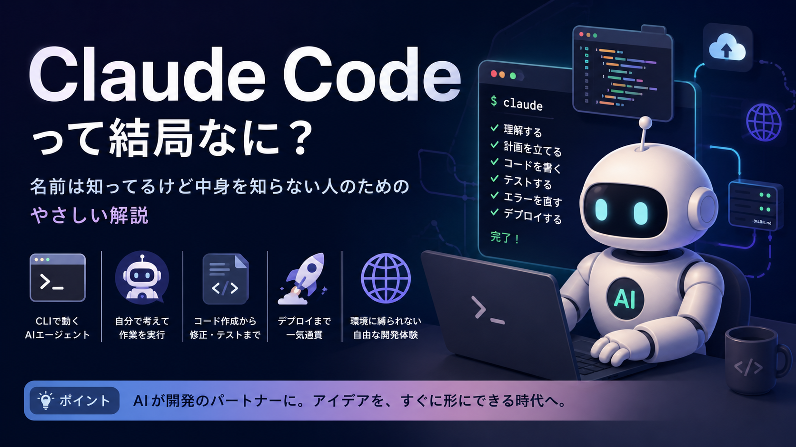
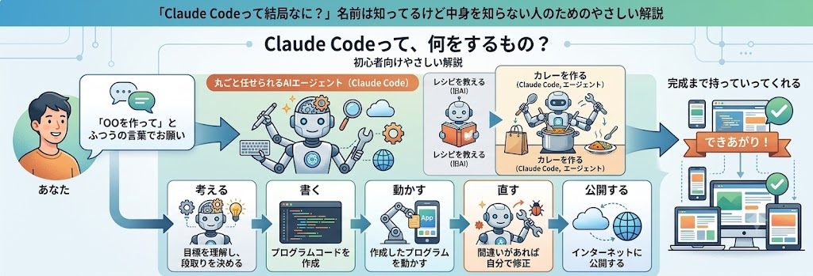
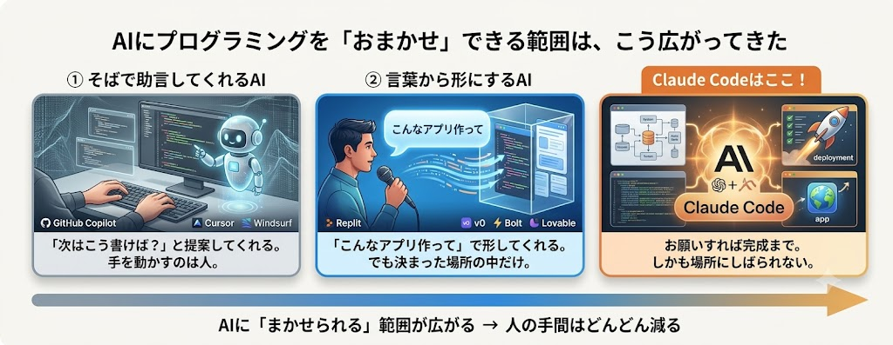
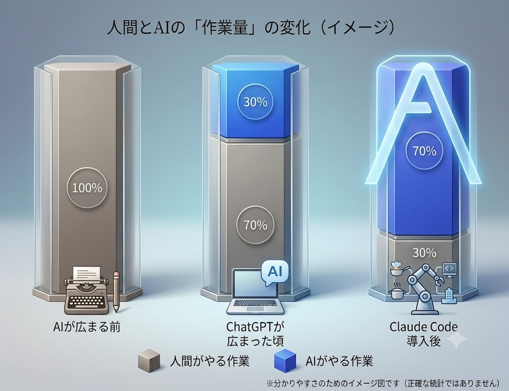

> この記事は、Zenn と Substack 両方に投稿することを想定して書いています。
> Substack に貼るときは、いちばん上の `---` で囲まれたブロック（フロントマター）を削除してから本文をコピーしてください。

## はじめに:「みんな使ってるけど、それ何？」という人へ

最近、エンジニアの友人や同僚、あるいはSNSで「Claude Code (クロード・コード)」という言葉を見かけませんか。「すごいらしい」「もう手放せない」——そんな声がたくさん飛び交っています。でも、いざ「で、結局なんなの？」と聞かれると、エンジニアでない人にはピンとこないのが正直なところだと思います。

この記事は、まさにそんな人—— **「名前は知ってるし周りが使ってるのは聞くけど、実際なにをするものか分かっていない」** という方に向けて書きました。専門用語はかみ砕いて説明するので、プログラミングの知識がなくても大丈夫です。

## Claude Codeって、結局なに？

ひとことで言うと、Claude Codeは **「ふつうの言葉でお願いすると、AIが自分で考えてプログラムを作り、完成まで持っていってくれる道具」** です。

まずは、これから説明することの全体像を1枚の絵にしました。

*▲ あなたは「何を作りたいか」を伝えるだけ。あとはおまかせ、というイメージです。*

### ポイントは「エージェント （＝丸ごと任せられるAI）」

Claude Codeを理解する最大のカギは「エージェント」という考え方です。これは、**目標を伝えると自分で段取りを考えて動いてくれるAI** のこと。

料理でたとえてみましょう。ふつうの便利なAIは、「カレーの作り方を教えて」と聞けば **レシピを教えてくれる** 存在です。一方でエージェントは、「カレーを作っておいて」とお願いすると、買い物に行き、野菜を切り、煮込み、味見をして、お皿に盛るところまで **自分で一気にやってくれる** 存在です。あなたは、でき上がったものを確認すればいい。この差は大きいですよね。

つまりClaude Codeは、「こういうものを作って」とお願いすると、**必要な作業を自分で組み立て、書いて、動かして、間違いがあれば直して、完成まで運んでくれるAIの開発担当者** なのです。

ちなみに、動く場所はエンジニアおなじみの「黒い画面」(ターミナルと呼ばれる、文字で命令する作業場) です。この一見地味な場所で動くことが、あとで出てくる「すごさ」につながってきます。

> 作っているのは、対話型AI「Claude」を手がけるアメリカのAI企業 **Anthropic （アンソロピック）** です。Claude Code自体は2025年に登場したばかり。たった1年ほどでこれだけ話題になっているのですから、その勢いがうかがえます。

## これまでのAIプログラミングは、3段階で進化してきた

Claude Codeのすごさは、「それまでがどうだったか」を知ると見えてきます。AIがプログラミングを手伝う方法は、ここ数年で大きく3段階に進化してきました。

**① そばで助言してくれるAI**
プログラムを書いている人の「隣」に座って、「次はこう書けば？」と提案してくれる段階です。スマホの文字入力で出る「予測変換」のプログラム版、と思うと分かりやすいです。便利だけれど、実際に手を動かすのはあくまで人間でした。

**② 言葉から形にしてくれるAI**
「こんなアプリ (サイト) が欲しい」と言葉で頼むと、その場で形にしてくれる段階です。みなさんがChatGPTに文章を書いてもらうのと近い感覚ですね。プログラミングを知らない人でも何かを作れる入り口になりました。ただし、その多くは **決まったサービスの中 （用意された箱の中） でしか作業できない** という制約がありました。

**③ 丸ごと任せられるAI**
そして、さきほどの「エージェント」が本格化します。タスクを渡せば、人がいちいち指示しなくても自分で進めてくれる段階です。**Claude Codeはここ** にいて、しかも次に説明するとおり「箱の中だけ」という制約も超えています。

> 🔍 **具体的なツール名が気になる人へ** (非エンジニアの方は読み飛ばしてOKです)
> 第1段階の例: GitHub Copilot、Cursor、Windsurfなど。
> 第2段階の例: Replit、v0、Bolt、Lovableなど。
> 第3段階の例: Devin、OpenAI Codex、Julesなど。
> 2026年現在は、第3段階 (エージェント型) でClaude CodeとOpenAIの「Codex」の2つが特に強いと言われています (※「職場での利用者数」だけ見ると、老舗のGitHub Copilotが今もトップという調査もあります)。

## 人間とAIの「作業量」は、こんなふうに変わった

文字だけだとイメージしづらいので、**「ものを作るとき、人間とAIがそれぞれどれくらい働くか」** の移り変わりを図にしてみました。

* **AIが広まる前**: 当然ながら、プログラムは人間がぜんぶ手作業で書いていました。
* **ChatGPTが広まった頃**: 分からないことを聞いたり、部分的に書いてもらったり。人間の負担が少し軽くなりました。とはいえ、組み立てて完成させるのは人間の仕事です。
* **Claude Code導入後**: 作業の大部分をAIが引き受け、人間は「何を作るか」を決めて、出てきたものを確認する役割が中心に。**主役が人からAIへ移りつつある**、という大きな変化です。

※この図はあくまで「だいたいこんな感じ」というイメージで、正確な統計ではありません。それでも、流れの大きさは伝わるはずです。

## 「手伝う」を超えて——作って、世に出すところまで

ここが、Claude Codeが「これまでと違う」と言われる最大の理由です。

第2段階までのツールには、共通の弱点がありました。**「決まったアプリやサービスの中でしか動けない」** という点です。たとえるなら、**とても優秀な料理人なのに、決められた1つのキッチンから一歩も出られない** ようなもの。包丁は使えても、隣の部屋の特別なオーブンや、外の市場には手が届きません。

Claude Codeは、この天井を突き破りました。さきほど触れた「黒い画面 (ターミナル) で動く」ことがその鍵です。あえてこの場所を選んだのは、**どんな環境の人でも同じように使えて、将来AIがもっと賢くなっても対応しやすいから**。おかげでClaude Codeは特定のアプリに縛られず、あらゆる道具を自由に使える「開放されたキッチンに立つ料理人」になりました。

その結果、アイデアを形にし、プログラムを書き、動作を確認し、修正し、さらには **作ったものを実際にインターネット上で公開して人が使える状態にする （デプロイと呼びます） ところまで、ひと続きでこなせる** ようになったのです。

## で、これがあると私たちに何がうれしいの？

Claude Codeの特徴を、「あなたにとって何がうれしいか」という目線で5つにまとめます。

1. **大きくて複雑なものでも、まるごと任せられる**
   * アプリやサイトは、たくさんの部品が複雑に絡み合ってできています。Claude Codeは全体を見渡して、あちこちをまとめて面倒を見てくれます。
   * → あなたは「何を作りたいか」だけ考えればOK。
2. **いくつもの頼みごとを同時に進めてくれる＝待たされない**
   * 「Aを直しながら、Bも作って」を並行で進められます。優秀な助手が何人もいる感覚です。
   → 待ち時間が減って、できあがりが早い。
3. **プログラミングを知らなくても、日本語で頼める** (いちばん大事)
   * 特別な呪文は不要。「ここをこうして」「やっぱり元に戻して」と、人に話しかけるように頼めます。
   * → つまり、**エンジニアでないあなたでも使える** ということ。
4. **頼んだら、ちゃんと動くところまで確かめてくれる**
   * 書くだけでなく、実際に動かして、間違いを自分で見つけて直します。
   * →「作ったけど動かない…」につまずきにくい。
5. **特定のアプリに縛られないから、できることが広い**
   * 1つの決まった場所の中だけではありません。
   * → 思いついたものを形にして、そのまま世に出すところまで一気にいけます。

## まとめ

* **Claude Codeとは**、ふつうの言葉でお願いすると、AIが自分で考えてプログラムを完成まで作ってくれる「AIの開発担当者 (エージェント)」。
* AIがプログラミングを手伝う方法は、**①そばで助言 → ②言葉から形に → ③丸ごとおまかせ** と進化してきた。Claude Codeは③にいる。
* ものづくりの **主役が人からAIへ移りつつある**。Claude Codeは、作って・動かして・世に出すところまでひと続きでこなせる。
* だから、**エンジニアでなくても「思いついたものを実現できる」** 時代が近づいている。これが、みんなが熱狂している理由です。

「名前は知ってるけど…」だったところから、「あれは"丸ごと任せられるAIの開発担当"のことだよ」と言えるくらいにはなれたのではないでしょうか。もし興味が湧いたら、エンジニアの友人に「Claude Codeってあれでしょ？」と話を振ってみてください。きっと話が弾むはずです。

---

### 参考文献

* [平川知秀『Claude CodeによるAI駆動開発入門』技術評論社, 2025年 (ISBN 978-4-297-15275-8)](https://amzn.to/4bcg7Vu)
* [Anthropic公式サイト「Claude Code」ページ](https://claude.com/ja/product/claude-code)
